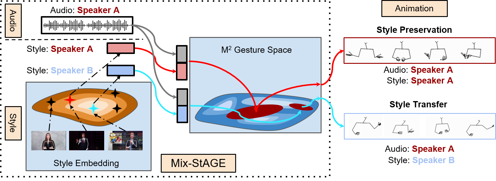

# Mix-Stage

This is the official repository for the paper *Style Transfer for Co-Speech Gesture Animation: A Multi-Speaker Conditional Mixture Approach* 

[Chaitanya Ahuja](http://chahuja.com), Dong Won Lee, [Yukiko Nakano](http://www.ci.seikei.ac.jp/nakano/index_e.html), [Louis-Philippe Morency](https://www.cs.cmu.edu/~morency/) - [ECCV2020](https://eccv2020.eu/)


Links: [Paper](https://arxiv.org/abs/2007.12553), [Demo+Project Website](http://chahuja.com/mix-stage), [Dataset Website](http://chahuja.com/pats)

# Overview



This repo has information on the training code and pre-trained models. 

For the dataset, we refer you to:
* [Dataset Website](http://chahuja.com/pats) for downloading the dataset
* [Dataset Repo](https://github.com/chahuja/pats) for scripts to download the audio files and other dataloader arguments. 

For the purposes of this repository, we assume that the dataset is downloaded to `../data/`

This repo is divided into the following sections:

* [Clone](#clone)
* [Set up environment](#set-up-environment)
* [Training](#training)
* [Inference](#inference)
* [Rendering](#rendering)

This is followed by additional informational sections:
* [Experiment Files](#experiment-files)
* [Inception Score for pose sequences](#inception-score-for-pose-sequences)

## Clone
As the project website is also hosted on this repository, clone only the master branch,

```sh
git clone -b master --single-branch https://github.com/chahuja/mix-stage.git
```

## Set up Environment
* pycasper

```sh
mkdir ../pycasper
git clone https://github.com/chahuja/pycasper ../pycasper
ln -s ../pycasper/pycasper .
```

* Create an [anaconda](https://www.anaconda.com/) or a virtual enviroment and activate it

```sh
pip install -r requirements.txt
```

## Training
To train a model from scratch, run the following script,

```sh
python train.py \
 -cpk JointLateClusterSoftStyle4_G \ ## checkpoint name which is a part of experiment file PREFIX
 -exp 1 \ ## creates a unique experiment number
 -path2data ../data ## path to data files
 -speaker '["corden", "lec_cosmic", "ytch_prof", "oliver"]' \ ## List of speakers
 -model JointLateClusterSoftStyle4_G \ ## Name of the model
 -modelKwargs '{"lambda_id": 0.1, "argmax": 1, "some_grad_flag": 1, "train_only": 1}' \ ## List of extra arguments to instantiate an object of the model
 -note mix-stage \ ## unique identifier for the model to group results
 -save_dir save/mix-stage \ ## save directory
 -modalities '["pose/normalize", "audio/log_mel_400"]' \ ## all modalities as a list. output modality first, then input modalities
 -fs_new '[15, 15]' \ ## frame rate of each modality
 -input_modalities '["audio/log_mel_400"]' \ ## List of input modalities
 -output_modalities '["pose/normalize"]' \ ## List of output modalities
 -gan 1 \ ## Flag to train with a discriminator on the output
 -loss L1Loss \ ## Choice of loss function. Any loss function torch.nn.* will work here
 -window_hop 5 \ ## Hop size of the window for the dataloader
 -render 0 \ ## flag to render. Default 0
 -batch_size 16 \ ## batch size
 -num_epochs 20 \ ## total number of epochs
 -overfit 0 \ ## flag to overfit (for debugging)
 -early_stopping 0 \ ## flag to perform early stopping 
 -dev_key dev_spatialNorm \ ## metric used to choose the best model
 -num_clusters 8 \ ## number of clusters in the Conditional Mix-GAN
 -feats '["pose", "velocity", "speed"]' \ ## Festures used to make the clusters
 -style_iters 3000 \ ## Number of training iterations per epoch
 -num_iters 3000 ## Maximum number of validation iterations per epoch
```

Scripts for training models in the paper can be found as follows,
- [Mix-StAGE](src/jobs/mix-stage.py)
- [StAGE](src/jobs/stage.py)

## Inference
### Inference for quantitative evaluation

```sh
python sample.py \
-load <path2weights> \ ## path to PREFIX_weights.p file
-path2data ../data ## path to data
```
### Sampling gestures with many-to-many style transfers

```sh
python sample.py \
-load <path2weights> \ ## path to PREFIX_weights.p file
-sample_all_styles 20 \ ## if value > 0, samples `value` number of intervals in all styles (= number of speakers)
-path2data ../data ## path to data
```

### Pre-trained models
Coming soon

## Rendering

```sh
python render.py \
-render 20 \ ## number of intervals to render
-load <path2weights> \ ## path to PREFIX_weights.p file
-render_text 0 ## if 1, render text on the video as well.
-path2data ../data ## path to data
```

## Experiment Files
Every experiment multiple files with the same PREFIX:

### Training files
* PREFIX_args.args - arguments stored as a dictionary
* PREFIX_res.json - results for every epoch
* PREFIX_weights.p - weights of the best model
* PREFIX_log.log - log file 
* PREFIX_name.name - name file to restore value of PREFIX

## Inference files
* PREFIX/ - directory containing sampled h5 files and eventually renders
* PREFIX_cummMetrics.json - metrics extimated at inference
* PREFIX_metrics.json - metrics estimated at inference for every style transfer separately
* PREFIX_style.pkl - style space conditioned gesture regions to compute t-SNE plots
* PREFIX_histogram.json - Histogram of each generator in conditional Mix-GAN giving an idea about which set of generators were important for which style.

## Inception Score for pose sequences
To measure inception scores for pose sequences (or gestures), we refer you to the class [`InceptionScoreStyle`](src/evaluation/metrics.py#L305)

# Issues
All research has a tag of work in progress. If you find any issues with this code, feel free to raise issues or pull requests (even better) and I will get to it as soon as humanly possible.
